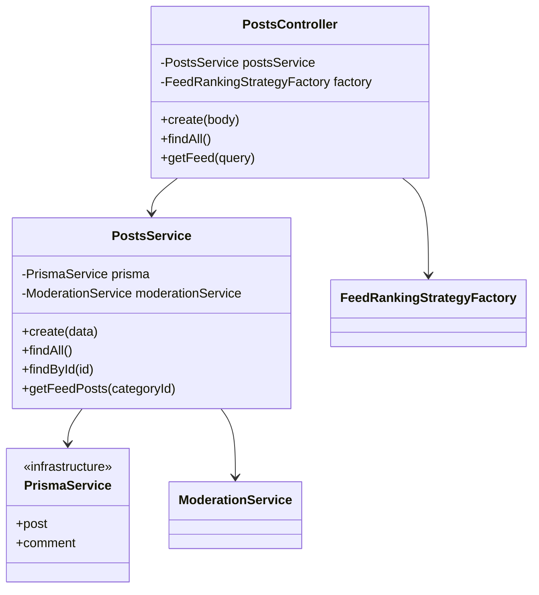
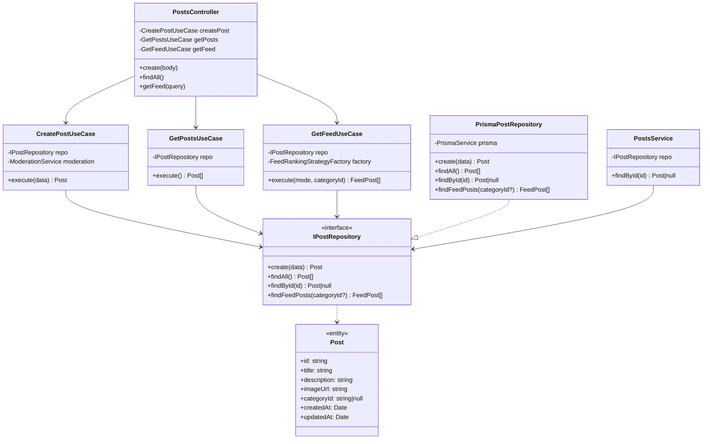

# AC_06 — Refactorización hacia Clean Architecture

## Integrantes del grupo

| Integrante | Módulo(s) asignado(s) |
|---|---|
| _LizardoFSA_ | Posts |
| _(nombre)_ | Comments |
| _(nombre)_ | Likes + Categories |
| _(nombre)_ | Moderation + Documentación |

---

## Lo que nos piden

La actividad entrega un servidor NestJS funcional y nos solicita:

1. Analizar el código fuente e identificar las **falencias arquitectónicas**.
2. Identificar los **puntos de refactorización** para aplicar Clean Architecture.
3. **Implementar Clean Architecture** en el servidor, preservando la funcionalidad existente.
4. Documentar los problemas encontrados y las soluciones aplicadas (este archivo).
5. Mantener el pipeline de GitHub Actions (lint, format y tests) en verde.

---

## Problemas identificados

### 1. Acoplamiento directo con la infraestructura (violación del DIP)

Los `Service` del proyecto dependen directamente de `PrismaService`, que es una clase concreta de la capa de infraestructura. Esto viola el **Dependency Inversion Principle**: los módulos de alto nivel (lógica de negocio) no deberían depender de módulos de bajo nivel (base de datos).

```typescript
// ❌ Antes — PostsService conoce y usa Prisma directamente
@Injectable()
export class PostsService {
    constructor(private readonly prisma: PrismaService) {}

    findAll() {
        return this.prisma.post.findMany({ orderBy: { createdAt: "desc" } })
    }
}
```

### 2. Ausencia de entidades de dominio

El código trabaja directamente con los registros que devuelve Prisma (tipos de infraestructura). No existen clases de dominio puras que representen los conceptos del negocio (`Post`, `Comment`, `Like`, etc.).

### 3. Ausencia de capa de casos de uso

Toda la lógica de negocio vive dentro de los `Service`. No existe una capa de **Use Cases / Application** que encapsule cada operación del sistema de forma explícita y testeable por separado.

### 4. Sin interfaces de repositorio

No hay contratos abstractos que desacoplen la lógica de negocio de cómo se almacenan los datos. Cambiar de SQLite a PostgreSQL, por ejemplo, obligaría a modificar cada servicio.

### 5. Dependencias cruzadas entre módulos

`CommentsService` y `LikesService` importan `PostsService` directamente para verificar la existencia de un post. Esto crea un acoplamiento horizontal entre módulos de dominio distintos.

```typescript
// ❌ LikesService importa PostsService de otro módulo
import { PostsService } from "@/posts/posts.service"

export class LikesService {
    constructor(private readonly postsService: PostsService) {}
}
```

### 6. DTOs compartidos entre módulos incorrectamente

`CreateCommentDto` y `AddLikeDto` están definidos dentro de `posts.dtos.ts`, pero son usados por los módulos `comments` y `likes`. Cada módulo debería poseer sus propios DTOs.

---

## Estructura objetivo: Clean Architecture

La refactorización aplica el siguiente esquema por cada módulo de dominio:

```
src/<módulo>/
├── domain/
│   ├── <entity>.entity.ts       ← Entidad de dominio pura (sin Prisma)
│   └── <entity>.repository.ts   ← Interfaz de repositorio + token DI
├── application/
│   └── use-cases/
│       └── <acción>.use-case.ts ← Un caso de uso por operación
├── infrastructure/
│   └── prisma-<entity>.repository.ts  ← Implementación concreta con Prisma
└── presentation/
    ├── <módulo>.controller.ts   ← Solo enruta HTTP, sin lógica
    └── <módulo>.dtos.ts         ← DTOs de entrada/salida
```

---

## Solución implementada

### Módulo `posts`

#### Arquitectura anterior



`PostsController` delegaba en `PostsService`, quien combinaba lógica de negocio (moderación, construcción del feed) con acceso directo a Prisma. No existía separación entre capas.

#### Arquitectura nueva



#### Archivos creados / modificados

| Archivo | Acción | Descripción |
|---|---|---|
| `domain/post.entity.ts` | Creado | Entidad `Post` + tipo `FeedPost` |
| `domain/post.repository.ts` | Creado | Interfaz `IPostRepository` + token `POST_REPOSITORY` |
| `infrastructure/prisma-post.repository.ts` | Creado | Implementación Prisma del repositorio |
| `application/use-cases/create-post.use-case.ts` | Creado | Caso de uso: crear post con moderación |
| `application/use-cases/get-posts.use-case.ts` | Creado | Caso de uso: listar todos los posts |
| `application/use-cases/get-feed.use-case.ts` | Creado | Caso de uso: obtener feed con ranking |
| `feed-ranking.strategy.ts` | Modificado | Importa `FeedPost` desde el dominio |
| `posts.controller.ts` | Modificado | Inyecta use cases en lugar de PostsService |
| `posts.service.ts` | Modificado | Reducido a fachada con solo `findById` |
| `posts.module.ts` | Modificado | Registra repositorio (por token) y use cases |

#### Fragmento clave: inversión de dependencias

```typescript
// ✅ Después — el use case depende de una interfaz, no de Prisma
@Injectable()
export class CreatePostUseCase {
    constructor(
        @Inject(POST_REPOSITORY)
        private readonly postRepository: IPostRepository, // ← interfaz abstracta
        private readonly moderationService: ModerationService,
    ) {}

    async execute(data: CreatePostDto) {
        const moderation = await this.moderationService.moderate(
            `${data.title} ${data.description}`
        )
        if (!moderation.approved) {
            throw new BadRequestException(moderation.reason)
        }
        return this.postRepository.create(data)
    }
}
```

```typescript
// PostsModule — la implementación concreta se registra aquí, no en el use case
{ provide: POST_REPOSITORY, useClass: PrismaPostRepository }
```

---

## Pendiente (resto del equipo)

- **Comments** — entidad `Comment`, `ICommentRepository`, use cases, mover `CreateCommentDto`
- **Likes + Categories** — entidades, repositorios e interfaces, mover `AddLikeDto`
- **Moderation** — entidad `ProhibitedWord`, `IProhibitedWordRepository`, use cases
