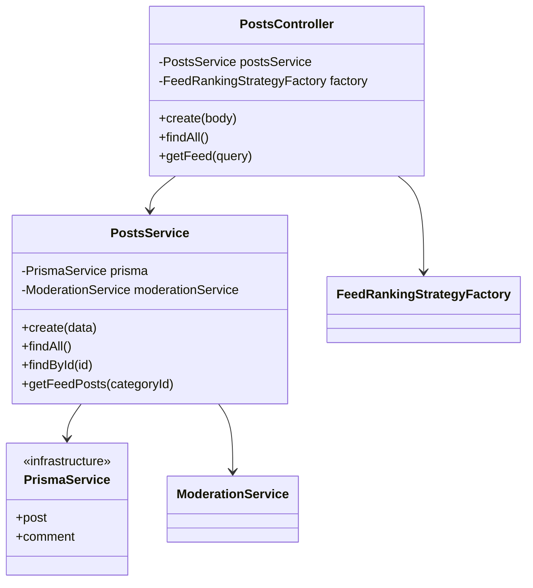
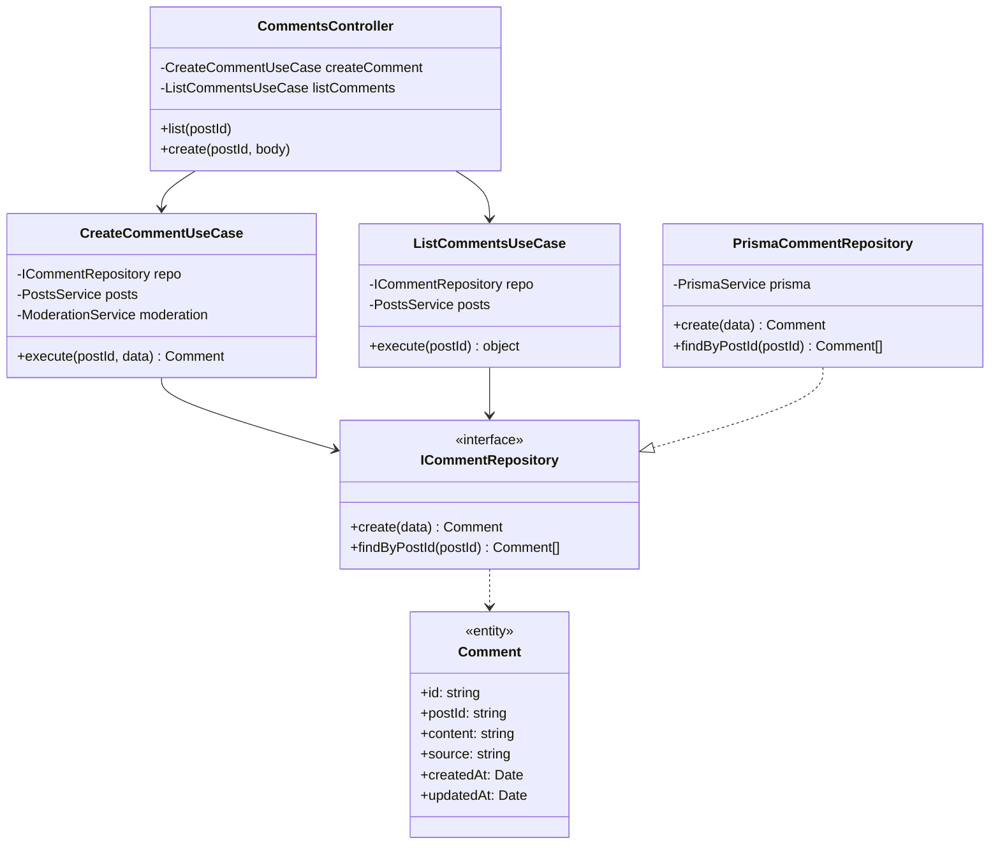
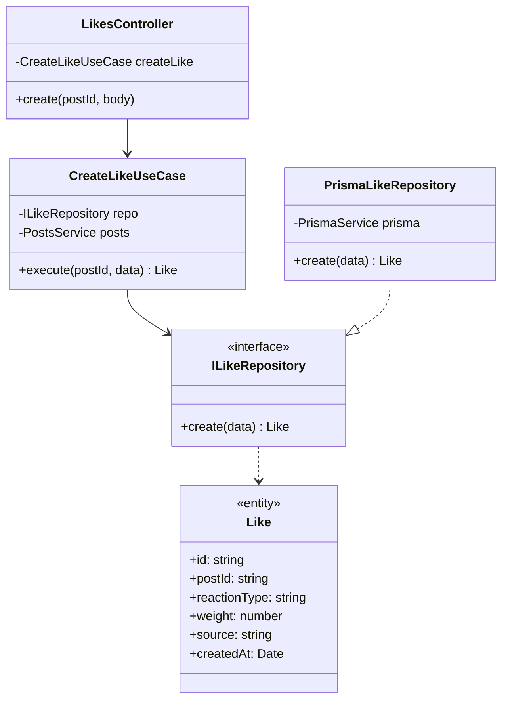
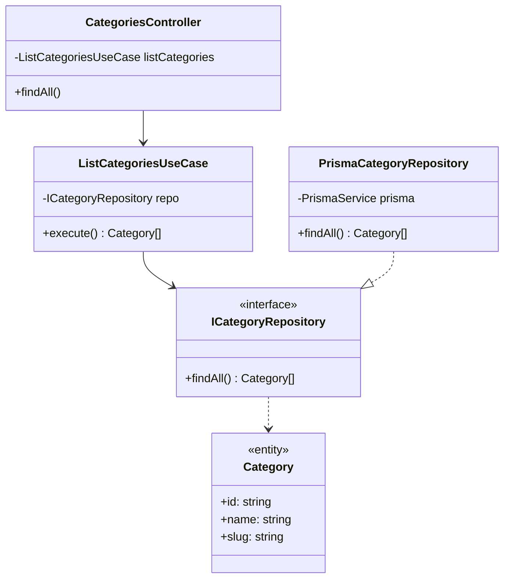
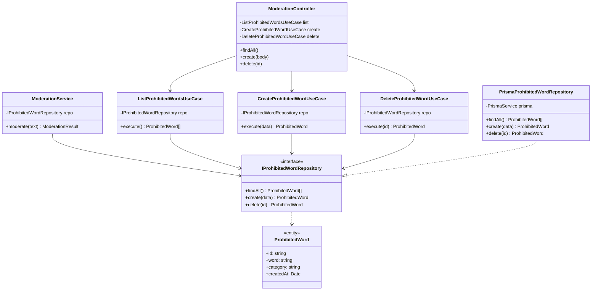

# AC_06 — Refactorización hacia Clean Architecture

## Integrantes del grupo

| Integrante |
|---|---|
| _LizardoFSA_ |
| _Benjamin De La Fuente_ |
| _Benjamin Aliaga_ |
| _Juan Carrera_ | |

---

## Lo que nos piden

La actividad entrega un servidor NestJS funcional y nos solicita:

1. Analizar el código fuente e identificar las **falencias arquitectónicas**.
2. Identificar los **puntos de refactorización** para aplicar Clean Architecture.
3. **Implementar Clean Architecture** en el servidor, preservando la funcionalidad existente.
4. Documentar los problemas encontrados y las soluciones aplicadas (este archivo).
5. Mantener el pipeline de GitHub Actions (lint, format y tests) en verde.

---

## Problemas identificados

### 1. Acoplamiento directo con la infraestructura (violación del DIP)

Los `Service` del proyecto dependen directamente de `PrismaService`, que es una clase concreta de la capa de infraestructura. Esto viola el **Dependency Inversion Principle**: los módulos de alto nivel (lógica de negocio) no deberían depender de módulos de bajo nivel (base de datos).

```typescript
// ❌ Antes — PostsService conoce y usa Prisma directamente
@Injectable()
export class PostsService {
    constructor(private readonly prisma: PrismaService) {}

    findAll() {
        return this.prisma.post.findMany({ orderBy: { createdAt: "desc" } })
    }
}
```

### 2. Ausencia de entidades de dominio

El código trabaja directamente con los registros que devuelve Prisma (tipos de infraestructura). No existen clases de dominio puras que representen los conceptos del negocio (`Post`, `Comment`, `Like`, etc.).

### 3. Ausencia de capa de casos de uso

Toda la lógica de negocio vive dentro de los `Service`. No existe una capa de **Use Cases / Application** que encapsule cada operación del sistema de forma explícita y testeable por separado.

### 4. Sin interfaces de repositorio

No hay contratos abstractos que desacoplen la lógica de negocio de cómo se almacenan los datos. Cambiar de SQLite a PostgreSQL, por ejemplo, obligaría a modificar cada servicio.

### 5. Dependencias cruzadas entre módulos

`CommentsService` y `LikesService` importan `PostsService` directamente para verificar la existencia de un post. Esto crea un acoplamiento horizontal entre módulos de dominio distintos.

```typescript
// ❌ LikesService importa PostsService de otro módulo
import { PostsService } from "@/posts/posts.service"

export class LikesService {
    constructor(private readonly postsService: PostsService) {}
}
```

### 6. DTOs compartidos entre módulos incorrectamente

`CreateCommentDto` y `AddLikeDto` están definidos dentro de `posts.dtos.ts`, pero son usados por los módulos `comments` y `likes`. Cada módulo debería poseer sus propios DTOs.

---

## Estructura objetivo: Clean Architecture

La refactorización aplica el siguiente esquema por cada módulo de dominio:

```
src/<módulo>/
├── domain/
│   ├── <entity>.entity.ts       ← Entidad de dominio pura (sin Prisma)
│   └── <entity>.repository.ts   ← Interfaz de repositorio + token DI
├── application/
│   └── use-cases/
│       └── <acción>.use-case.ts ← Un caso de uso por operación
├── infrastructure/
│   └── prisma-<entity>.repository.ts  ← Implementación concreta con Prisma
└── presentation/
    ├── <módulo>.controller.ts   ← Solo enruta HTTP, sin lógica
    └── <módulo>.dtos.ts         ← DTOs de entrada/salida
```

---

## Solución implementada

### Módulo `posts`

#### Arquitectura anterior



`PostsController` delegaba en `PostsService`, quien combinaba lógica de negocio (moderación, construcción del feed) con acceso directo a Prisma. No existía separación entre capas.

#### Arquitectura nueva


#### Archivos creados / modificados

| Archivo | Acción | Descripción |
|---|---|---|
| `domain/post.entity.ts` | Creado | Entidad `Post` + tipo `FeedPost` |
| `domain/post.repository.ts` | Creado | Interfaz `IPostRepository` + token `POST_REPOSITORY` |
| `infrastructure/prisma-post.repository.ts` | Creado | Implementación Prisma del repositorio |
| `application/use-cases/create-post.use-case.ts` | Creado | Caso de uso: crear post con moderación |
| `application/use-cases/get-posts.use-case.ts` | Creado | Caso de uso: listar todos los posts |
| `application/use-cases/get-feed.use-case.ts` | Creado | Caso de uso: obtener feed con ranking |
| `feed-ranking.strategy.ts` | Modificado | Importa `FeedPost` desde el dominio |
| `posts.controller.ts` | Modificado | Inyecta use cases en lugar de PostsService |
| `posts.service.ts` | Modificado | Reducido a fachada con solo `findById` |
| `posts.module.ts` | Modificado | Registra repositorio (por token) y use cases |

#### Fragmento clave: inversión de dependencias

```typescript
// ✅ Después — el use case depende de una interfaz, no de Prisma
@Injectable()
export class CreatePostUseCase {
    constructor(
        @Inject(POST_REPOSITORY)
        private readonly postRepository: IPostRepository, // ← interfaz abstracta
        private readonly moderationService: ModerationService,
    ) {}

    async execute(data: CreatePostDto) {
        const moderation = await this.moderationService.moderate(
            `${data.title} ${data.description}`
        )
        if (!moderation.approved) {
            throw new BadRequestException(moderation.reason)
        }
        return this.postRepository.create(data)
    }
}
```

```typescript
// PostsModule — la implementación concreta se registra aquí, no en el use case
{ provide: POST_REPOSITORY, useClass: PrismaPostRepository }
```

---

---

### Módulo `comments`

#### Arquitectura anterior

`CommentsService` dependía directamente de `PrismaService` y de `PostsService`. Los DTOs vivían en `posts.dtos.ts`. No existían entidades ni interfaz de repositorio.

#### Arquitectura nueva



#### Archivos creados / modificados

| Archivo | Acción | Descripción |
|---|---|---|
| `domain/comment.entity.ts` | Creado | Entidad `Comment` pura |
| `domain/comment.repository.ts` | Creado | Interfaz `ICommentRepository` + token `COMMENT_REPOSITORY` |
| `infrastructure/prisma-comment.repository.ts` | Creado | Implementación Prisma del repositorio |
| `application/use-cases/create-comment.use-case.ts` | Creado | Caso de uso: crear comentario con moderación |
| `application/use-cases/list-comments.use-case.ts` | Creado | Caso de uso: listar comentarios con total |
| `comments.dtos.ts` | Creado | `CreateCommentDto` movido desde `posts.dtos.ts` |
| `comments.controller.ts` | Modificado | Inyecta use cases; ya no depende de `CommentsService` |
| `comments.module.ts` | Modificado | Registra repositorio por token y ambos use cases |

#### Detalle: respuesta enriquecida de `ListCommentsUseCase`

A diferencia del módulo posts, el listado de comentarios devuelve un objeto con el total calculado en la capa de aplicación:

```typescript
async execute(postId: string) {
    const comments = await this.commentRepository.findByPostId(postId)
    return {
        total_comments: comments.length,
        comments,
    }
}
```

---

### Módulo `likes`

#### Arquitectura anterior

`LikesService` dependía directamente de `PrismaService` y de `PostsService`. `AddLikeDto` estaba en `posts.dtos.ts`. No existían entidades ni interfaz de repositorio.

#### Arquitectura nueva



#### Archivos creados / modificados

| Archivo | Acción | Descripción |
|---|---|---|
| `domain/like.entity.ts` | Creado | Entidad `Like` pura |
| `domain/like.repository.ts` | Creado | Interfaz `ILikeRepository` + token `LIKE_REPOSITORY` |
| `infrastructure/prisma-like.repository.ts` | Creado | Implementación Prisma del repositorio |
| `application/use-cases/create-like.use-case.ts` | Creado | Caso de uso: registrar like con validación de peso |
| `likes.dtos.ts` | Creado | `AddLikeDto` movido desde `posts.dtos.ts` |
| `likes.controller.ts` | Modificado | Inyecta `CreateLikeUseCase`; ya no depende de `LikesService` |
| `likes.module.ts` | Modificado | Registra repositorio por token y use case |
| `likes.service.ts` | Eliminado | Toda la lógica migrada al use case |

---

### Módulo `categories`

#### Arquitectura anterior

No existía módulo de categorías. Las categorías se manejaban como dato auxiliar de los posts directamente desde Prisma.

#### Arquitectura nueva



#### Archivos creados

| Archivo | Acción | Descripción |
|---|---|---|
| `domain/category.entity.ts` | Creado | Entidad `Category` pura |
| `domain/category.repository.ts` | Creado | Interfaz `ICategoryRepository` + token `CATEGORY_REPOSITORY` |
| `infrastructure/prisma-category.repository.ts` | Creado | Implementación Prisma del repositorio |
| `application/use-cases/list-categories.use-case.ts` | Creado | Caso de uso: listar categorías ordenadas por nombre |
| `categories.controller.ts` | Creado | Endpoint `GET /api/categories` |
| `categories.module.ts` | Creado | Módulo completo con token y use case registrados |

---

---

### Módulo `moderation`

#### Arquitectura anterior

`ModerationService` dependía directamente de `PrismaService` para leer palabras prohibidas y para el CRUD del panel admin. No existían entidades de dominio ni interfaz de repositorio.

```typescript
// ❌ Antes — ModerationService conoce y usa Prisma directamente
@Injectable()
export class ModerationService {
    constructor(private readonly prisma: PrismaService) {}

    async moderate(text: string) {
        const words = await this.prisma.prohibitedWord.findMany()
        // ...
    }

    findAll() { return this.prisma.prohibitedWord.findMany() }
    create(word, category) { return this.prisma.prohibitedWord.create(...) }
    delete(id) { return this.prisma.prohibitedWord.delete(...) }
}
```

#### Arquitectura nueva

`ModerationService` queda reducido a su responsabilidad de dominio: evaluar texto contra las palabras prohibidas. El CRUD admin se mueve a use cases propios. Ambos dependen de `IProhibitedWordRepository`.



#### Archivos creados / modificados

| Archivo | Acción | Descripción |
|---|---|---|
| `domain/prohibited-word.entity.ts` | Creado | Entidad `ProhibitedWord` pura |
| `domain/prohibited-word.repository.ts` | Creado | Interfaz `IProhibitedWordRepository` + token `PROHIBITED_WORD_REPOSITORY` |
| `infrastructure/prisma-prohibited-word.repository.ts` | Creado | Implementación Prisma con manejo de `P2025` (not found) |
| `application/use-cases/list-prohibited-words.use-case.ts` | Creado | Caso de uso: listar palabras prohibidas |
| `application/use-cases/create-prohibited-word.use-case.ts` | Creado | Caso de uso: agregar palabra prohibida |
| `application/use-cases/delete-prohibited-word.use-case.ts` | Creado | Caso de uso: eliminar palabra prohibida |
| `moderation.service.ts` | Modificado | Reducido a solo `moderate()`, inyecta interfaz en lugar de Prisma |
| `moderation.controller.ts` | Modificado | Inyecta use cases en lugar de `ModerationService` |
| `moderation.module.ts` | Modificado | Registra repositorio por token, use cases y mantiene export de `ModerationService` |

---

